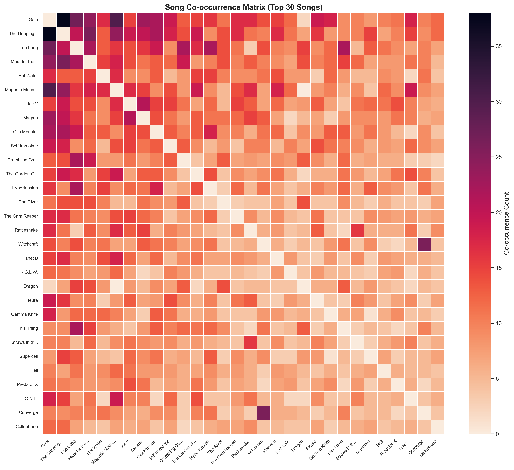

# King Gizzard Setlist Prediction

King Gizzard & The Lizard Wizard is an Australian band known for their prolific discography (27 albums as of 2025 spanning across multiple genres) and energetic live performances. Their setlists are notoriously unpredictable, with the band often making the setlist the day of the show.


**Can we predict which songs will be played at a future King Gizzard concert?** This project aims to answer this question using modern machine learning and deep learning techniques.

---

## Why This Problem is Interesting

King Gizzard's setlists are highly unpredictable. Looking at recent (2022+) consecutive shows, we find almost no overlap:


The median overlap between consecutive shows is **0%** (measured by Jaccard similarity), with a mean of only 5.88%. This is due to the band's "no repeat" rule, where they avoid playing the same songs in back-to-back shows. 

However, fans of the band know that there are patterns in the setlist structure.

### Co-occurrence Patterns

Looking at the data more carefully, we see that **certain songs almost always appear together**. These "song suites" reveal deep structural patterns in how the band constructs setlists. 

These patterns can be naturally quantified through the *co-occurrence matrix* of songs, whose values represent how often (raw count) pairs of songs are played together in the same show.

#### The Co-occurrence Matrix

Mathematically, the co-occurrence matrix $C$ is defined via

$$
C_{ij} = \text{count of shows where both } song_i \text{ and } song_j \text{ appear together}.
$$



The heatmap above shows co-occurrence counts for the top 30 most-played songs.

**Interpretation:** Darker colors = songs that frequently appear together. We note that there is a strong block structure, indicating clusters of songs that are often played together (e.g., "Rattlesnake" + "Straws in the Wind").

We note that while this is useful for sensing patterns, this metric is fundamentally biased toward popular songs. For example, if "Rattlesnake" appears in 100 shows, it will have high co-occurrence with many songs simply because it is played often. 

To address this issue, we build features using **Pointwise Mutual Information (PMI)** between songs instead, which is a statistical measure of association that normalizes for individual song frequencies.

#### PMI (Pointwise Mutual Information)
Given two songs $song_i$ and $song_j$, the PMI between them is defined via the formula

$$\text{PMI}(song_i, song_j) = \log \frac{\mathbb{P}(song_i, song_j)}{\mathbb{P}(song_i) \cdot \mathbb{P}(song_j)},$$

where
- $\mathbb{P}(song_i, song_j)$ = probability both songs appear in the same show (frequency)
- $\mathbb{P}(song_i)$ = probability song $i$ appears (marginal frequency)
- $\mathbb{P}(song_j)$ = probability song $j$ appears (marginal frequency)


The heatmap above shows PMI values for the top 30 most-played songs.

**Interpretation:**
- PMI > 2.0 (Deep red): Very strong positive association (almost always played together)
- PMI > 1.0: Strong positive association (frequently played together)
- PMI > 0.5: Moderate positive association (often played together)
- PMI ≈ 0.0: No association (appears together by random chance)
- PMI < -0.5: Moderate negative association (rarely together)
- PMI < -1.0 (Deep blue): Strong negative association (actively avoid each other)

**High PMI = Strong Positive Association:** A PMI > 1.0 indicates a very strong association. For example:
- "Converge" + "Witchcraft": PMI = 1.44 (they transition into each other seamlessly)
- "Rattlesnake" + "Straws in the Wind": PMI = 0.92 (frequently paired)

**Negative PMI = Avoidance:** Songs with PMI < -1.0 actively avoid each other:
- "Gaia" + "Dragon": PMI = -1.89 (almost never played together)
- The deep blue cells (like Gaia-Dragon) are particularly interesting. These songs actively avoid each other, perhaps because they serve similar roles in setlists or require different pedal configurations. 


#### How We Use PMI in Our Models

**Stages 1-3 (Traditional ML & Neural Tabular)**:
- We created 3 PMI-derived features for each (show, song) pair, which is included in the training data for the models in Stages 1~3.
  1. `avg_cooccurrence`: Average PMI between the candidate song and all other songs in the show
  2. `max_cooccurrence`: Maximum PMI between the candidate song and any song in the show
  3. `num_common_cooccur`: Number of songs in the show with positive PMI

**Stages 4-5 (GNN Models)**:
- Build a co-occurrence graph where edges = raw co-occurrence counts
- The GNN learns through message passing, implicitly discovering PMI-like relationships
- No explicit PMI features needed as the graph structure captures associations automatically

### Genre Patterns

King Gizzard is known for their genre diversity, as they have released albums spanning psych rock, blues rock, metal, synth-pop, jazz fusion, and more. The data shows that recent setlists typically feature songs from 4~6 different genres, creating a balanced musical experience for the audience.

#### Example: Genre-Balanced Setlist

**2025-08-16, Buena Vista**
1. Gila Monster (Metal)
2. Flamethrower (Metal)
3. Planet B (Metal)
4. Slow Jam 1 (Psych)
5. Empty (Psych)
6. Hot Water (Psych)
7. Superbug (Metal)
8. Magenta Mountain (Synth)
9. The Grim Reaper (Synth)
10. Flamethrower (Metal)
11. Welcome to an Altered Future (Metal)
12. Digital Black (Metal)
13. Han-Tyumi the Confused Cyborg (Metal)
14. Soy‐Protein Munt Machine (Metal)
15. Vomit Coffin (Metal)
16. Murder of the Universe (Metal)
17. Le Risque (Blues)
18. Ice V (Jam)
19. Raw Feel (Blues)
20. Hot Water (Psych)
21. Boogieman Sam (Blues, Boogie)
22. Straws in the Wind (Microtonal)
23. Pleura (Microtonal)
24. All Is Known (Microtonal)
25. Rattlesnake (Microtonal)


**Notice the flow:** KG setlists often alternate between high-energy (metal, garage) and groovy (psych-pop, synth) songs. We believe that this pacing is intentional - the band uses genre diversity to manage energy while keeping the audience engaged.

### Hypothesis after Basic EDA

Our hypothesis after some basic exploratory data analysis is that by building models that can learn from these co-occurrence patterns and temporal dynamics, we might be able to predict future setlists with reasonable accuracy.

---

## Key Findings

We discovered several important patterns through our experiments.

### 1. Venue and Location Features are Most Predictive

XGBoost feature importance analysis revealed that **venue-related features dominate predictions**:
- Venue-specific play rates (how often songs are played at specific venues)
- Geographic features (country, city)
- Venue type (festival vs. regular show)


This makes intuitive sense: King Gizzard tailors setlists to venues. Red Rocks gets different songs than a small club.

### 2. The Models Can Learn the "No Repeat" Rule

We found that XGBoost can learn that King Gizzard avoids repeating songs between consecutive shows.
- Recency features like `days_since_last` and `time_decay_15d` rank in the top 10 by frequency. These features track when a song was last played and penalize recently-played songs
- Residency features (e.g., `residency_night_number`) also help models avoid repeats during multi-night runs
- Later models (Stage 5 GNN) explicitly learn this as a "recency prior" with learned weight $\beta=0.478$.


The weight importance metric shows how frequently XGBoost uses each feature in decision trees. Recency and residency features appear consistently, showing the model relies on them to avoid predicting songs that were just played.

### 3. Recent Data (More Structure) > Full Dataset (More Data)

We conducted an A/B test comparing:
- **Filtered (2022+)**: 220 shows, more consistent setlist patterns
- **Unfiltered (all data)**: 500+ shows, includes diverse eras (early gizz, rats nest era, etc.)

**Result (Logistic Regression)**: Filtered data performed **better** (25.68% vs 25.00% Recall@15)

**Likely explanation**: Recent shows have more predictable structure, while older shows (2010-2020) had different touring patterns.

### 4. Specialized Shows Should Be Filtered

We tested the impact of including orchestra shows and rave shows (using Logistic Regression), which have different setlist patterns:

| Configuration | Recall@15 | Notes |
|--------------|-----------|-------|
| **With orchestra/rave** | ~23% | Model confused by specialized setlists |
| **Filtered** | ~26% | Cleaner patterns, better generalization |

**Insight**: Orchestra shows (rigid setlist) and rave shows (synth table only) don't follow normal setlist patterns. Including them hurts performance.

### 5. Graph Structure Captures Co-occurrence Patterns

The biggest performance jump came from treating the problem as a temporal set prediction problem (inspired by the work in [1]) and modeling songs as a graph.
- Songs that are frequently played together form clusters
- Many songs are played in pairs or groups (Mind Fuzz Suite, Nonagon Suite, "Converge" -> "Witchcraft", etc.)
- GNN learns these patterns automatically

We also use the techniques in SAFERec [2] to add frequency and recency priors to the GNN predictions, which are used to further boost performance.


---

## Dataset Overview

- **Source**: setlist.fm
- **Time period**: 2022-01-01 to 2025-10-25
- **Shows**: 220 concerts
- **Songs**: 203 unique tracks
- **Setlist entries**: 3,251 song performances

### Data Characteristics
- **Average setlist size**: 14.8 songs (range: 8-34)
- **Marathon shows**: 17 extended performances (3-hour shows with 22-34 songs)
- **Long-tail distribution**: Many songs played rarely (sparse, challenging problem)
- **Temporal split for training**: 70% train, 15% validation, 15% test (chronological order)

### Filtered Data Decisions

Based on our experiments, we made these filtering decisions:

1. **Time period**: 2022+ only (more recent = more structure)
2. **Specialized shows**: Excluded orchestra shows and rave shows
   - Orchestra: very rigid setlist, plays Phantom Island (album 27) in full
   - Rave: Electronic-focused, different patterns
3. **Partial setlists**: Excluded incomplete data

**Impact**: +2-3% Recall@15 improvement from proper filtering

After performing the aforementioned A/B test, we trained most of our models on the most recent 220 concerts from 2022-present with 203 unique songs.


### Song Distribution


The data shows a classic long-tail distribution:
- Some songs are "staples" (played 100+ times)
- Many songs are rare (played 1-5 times)
- Average setlist: 15 songs per show

This imbalance makes prediction even harder - the model needs to learn when rare songs get played.

---

## Key Model Architectures

### XGBoost (Stage 2):

```
┌─────────────────────────────────────────────────────────┐
│ User Inputs (Required):                                 │
│ • Date: "2025-11-01"                                    │
│ • Venue: "Red Rocks Amphitheatre" (or venue_id)         │
│ • Tour: "Fall 2025 Tour"                                │
│                                                         │
│ Optional Inputs:                                        │
│ • is_marathon: True/False (marathon = 24+ songs)        │
│ • is_festival: True/False                               │
│ • country: "US" (auto-derived for known venues)         │
│                                                         │
│ Note: System auto-looks up country for 362 known        │
│       venues. For new venues, provide country.          │
└─────────────────────────────────────────────────────────┘
                         │
                         ▼
┌─────────────────────────────────────────────────────────┐
│ Feature Engineering (34 features)                       │
│ • Frequency: venue_play_rate, global_frequency          │
│ • Recency: days_since_played, shows_since_played        │
│ • Time-Decay: exp_decay_15d, exp_decay_30d, 60d         │
│ • Context: is_festival, is_marathon, country            │
│ • Residency: residency_night_number, total_nights       │
│ • Temporal: played_in_last_N_shows (5 flags)            │
└─────────────────────────────────────────────────────────┘
                         │
                         ▼
┌─────────────────────────────────────────────────────────┐
│ XGBoost Model                                           │
│ • 1000 trees                                            │
│ • max_depth = 6                                         │
│ • learning_rate = 0.299                                 │
└─────────────────────────────────────────────────────────┘
                         │
                         ▼
┌─────────────────────────────────────────────────────────┐
│ Output: Top-15 Songs + Probabilities                    │
│ Example: ["Rattlesnake": 0.87, "The River": 0.82, ...]  │
└─────────────────────────────────────────────────────────┘
```

### GNN (Stage 4): Temporal Graph Neural Network

```
┌─────────────────────────────────────────────────────────┐
│ User Inputs (Required):                                 │
│ • Date: "2025-11-01"                                    │
│ • Venue: "Red Rocks Amphitheatre"                       │
│ • Tour: "Fall 2025 Tour"                                │
│ • Country: "United States" (for new venues)             │
│                                                         │
│ Optional Inputs:                                        │
│ • is_marathon: True/False                               │
│ • is_festival: True/False                               │
│                                                         │
│ Note: Country can be auto-derived for known venues      │
└─────────────────────────────────────────────────────────┘
                         │
                         ▼
┌─────────────────────────────────────────────────────────┐
│ ShowContextRetriever: Auto-Fetch Previous 5 Setlists    │
│ • Query database for last 5 shows before target date    │
│ • Exclude partial setlists                              │
│ • Return chronologically sorted setlists                │
└─────────────────────────────────────────────────────────┘
                         │
                         ▼
┌─────────────────────────────────────────────────────────┐
│ Build Co-occurrence Graph from Retrieved Setlists       │
│ • Nodes: Songs (203 songs)                              │
│ • Edges: Co-play counts from retrieved setlists         │
│ • Dynamic (updates with each show)                      │
└─────────────────────────────────────────────────────────┘
                         │
                         ▼
┌─────────────────────────────────────────────────────────┐
│ Graph Convolution (2 layers)                            │
│ • Spread information between connected songs            │
│ • Learn song clusters (e.g., "Rattlesnake" cluster)     │
└─────────────────────────────────────────────────────────┘
                         │
                         ▼
┌─────────────────────────────────────────────────────────┐
│ Temporal Attention                                      │
│ • Weight recent shows more heavily                      │
│ • Capture evolving patterns                             │
└─────────────────────────────────────────────────────────┘
                         │
                         ▼
┌─────────────────────────────────────────────────────────┐
│ Context Embeddings (64-dimensional)                     │
│ • Venue embedding                                       │
│ • Tour embedding                                        │
│ • Country embedding                                     │
└─────────────────────────────────────────────────────────┘
                         │
                         ▼
┌─────────────────────────────────────────────────────────┐
│ Output: Top-15 Songs + Probabilities                    │
│ Learned from graph patterns                             │
└─────────────────────────────────────────────────────────┘
```

### GNN + Priors (Stage 5): Best Model

```
┌─────────────────────────────────────────────────────────┐
│ User Inputs (Required):                                 │
│ • Date: "2025-11-01"                                    │
│ • Venue: "Red Rocks Amphitheatre"                       │
│ • Tour: "Fall 2025 Tour"                                │
│ • Country: "United States" (for new venues)             │
│                                                         │
│ Optional Inputs:                                        │
│ • is_marathon: True/False                               │
│ • is_festival: True/False                               │
│                                                         │
│ Note: Country can be auto-derived for known venues      │
└─────────────────────────────────────────────────────────┘
                         │
                         ▼
┌─────────────────────────────────────────────────────────┐
│ ShowContextRetriever: Auto-Fetch Previous 5 Setlists    │
│ • Query database for last 5 shows before target date    │
│ • Exclude partial setlists                              │
│ • Return chronologically sorted setlists                │
└─────────────────────────────────────────────────────────┘
                         │
                         ▼
┌─────────────────────────────────────────────────────────┐
│ Build Co-occurrence Graph from Retrieved Setlists       │
│ • Nodes: 203 songs                                      │
│ • Edges: Co-play counts                                 │
└─────────────────────────────────────────────────────────┘
                         │
                         ▼
┌─────────────────────────────────────────────────────────┐
│ GNN Path: Graph Convolution + Temporal Attention        │
│ • 2-layer GCN spreads information across graph          │
│ • Attention weights recent shows more heavily           │
│ • Context embeddings: venue (16d) + tour (16d) +        │
│   country (8d) + is_festival (8d) + is_marathon (8d)    │
│ • Output: logits_gnn [num_songs]                        │
└─────────────────────────────────────────────────────────┘
                         │
                         ▼
┌─────────────────────────────────────────────────────────┐
│ ADD Frequency Prior (learnable weight alpha)            │
│ • freq_scores = log(1 + count / total_shows)            │
│ • logits = logits_gnn + alpha  *  freq_scores           │
│ • alpha initialized at 0.5, learned during training     │
└─────────────────────────────────────────────────────────┘
                         │
                         ▼
┌─────────────────────────────────────────────────────────┐
│ ADD Recency Prior (learnable weight beta)               │
│ • recency_scores = -Σ(decay^t  *  played[t])            │
│   (negative to penalize recently-played songs)          │
│ • logits = logits + beta  *  recency_scores             │
│ • beta initialized at 0.5, learned during training      │
└─────────────────────────────────────────────────────────┘
                         │
                         ▼
┌──────────────────────────────────────────────────────────────────────┐
│ L2 Regularization on alpha/beta During Training                      │
│ • loss = BCE_loss + reg_weight  *  (alpha² + beta²)                  │
│ • Prevents weights from exploding                                    │
│ • Balance: strong reg (0.1) -> alpha≈0.06, weak (0.01) -> alpha≈0.35 │
└──────────────────────────────────────────────────────────────────────┘
                         │
                         ▼
┌─────────────────────────────────────────────────────────┐
│ Output: Top-15 Songs Ranked by Final Logits             │
└─────────────────────────────────────────────────────────┘
```

**Key Components**:
1. **ShowContextRetriever Module**: Automatically retrieves the 5 most recent setlists from the database given minimal user input (date, venue, tour). User doesn't need to manually provide historical context - the system handles it.
2. **Sequential Prior Combination**: GNN predictions are enhanced by adding frequency (alpha * freq) and recency (beta * rec) priors sequentially. The learnable weights (alpha, beta) allow the model to balance graph patterns with statistical priors during training.
3. **Dynamic Recall@K**: Since marathon shows have longer setlists, the models report back Recall@24 instead of Recall@15 for marathon shows, providing a fairer evaluation metric.
4. **Feature Dropout for Cold Start**: To handle new venues/tours, we apply BERT-style feature dropout during training (detailed below).
---

## The Cold Start Problem (New Venues/Tours)

One of the biggest challenges in recommendation systems is the **cold start problem**: what happens if a future show is at a new venue or on a new tour?

### The Problem

Traditional models struggle with new contexts:
- **Venue-specific features**: What if the model has never seen "New Venue X"?
- **Tour-specific patterns**: What if this is a brand new tour?
- **Embedding failure**: Learned embeddings for venues/tours don't exist for new ones

### Our Solution: BERT-Style Feature Dropout

We borrowed a standard technique from NLP (BERT pre-training, see [5]) and applied it to setlist prediction:

**During Training**:
1. Randomly mask 15% of venue/tour features
2. Replace with one of three options:
   - 80% of the time: Replace with [UNK] token
   - 10% of the time: Replace with random venue/tour
   - 10% of the time: Keep unchanged

**Why This Works**:
- Forces the model to predict songs without relying on specific venue/tour
- Model learns to use global patterns when context is missing
- Gracefully degrades: Uses venue features when available, ignores when not

### Results

| Model | Recall@15 | Impact |
|-------|-----------|--------|
| Stage 4A (GNN, no dropout) | 43.96% | Baseline GNN |
| Stage 4B (GNN + dropout) | 44.08% | +0.12% - minimal improvement |
| Stage 5 (GNN + dropout + priors) | 47.03% | +2.95% over Stage 4B |
| Stage 5B (Final, hyperparameter-tuned) | 52.66% | +8.58% over Stage 4B |

**Key Insight**: Feature dropout provides marginal improvement on its own (+0.12%), but becomes critical when combined with priors in Stage 5. The main performance gains come from:
1. **Priors** (frequency + recency): +2.95% improvement
2. **Hyperparameter tuning**: Additional +5.63% improvement
3. **Dropout for stability**: Prevents overfitting with priors, enabling better generalization and cold start handling

**Production Impact**: The model now works for:
- New venues (hasn't seen before)
- New tours (first show of a tour)
- Missing data (incomplete venue information)

**Tradeoff**: Dropout adds minimal overhead (~2% slower training) but significantly improves robustness to unseen contexts.

---

## Feature Engineering

We engineered **34 features** across 5 categories:

### 1. Frequency Features (Most Important)

These measure how often songs are played in different contexts:

| Feature | Description | Example Value |
|---------|-------------|---------------|
| `song_global_frequency` | % of all shows with this song | 0.75 (played 75% of shows) |
| `venue_play_rate` | % of shows at this venue with song | 0.90 (Red Rocks favorite) |
| `tour_play_rate` | % of shows on this tour with song | 0.60 (tour staple) |
| `country_play_rate` | % of shows in this country with song | 0.80 (US favorite) |

**Why they matter**: Some songs are universally popular. Others are venue-specific or tour-specific.

### 2. Recency Features

These capture the "no repeat" rule:

| Feature | Description | Example Value |
|---------|-------------|---------------|
| `days_since_played` | Days since song was last played | 7 (played 1 week ago) |
| `shows_since_played` | Number of shows since last played | 3 (3 shows ago) |
| `recency_score` | Exponential decay: exp(-0.5 * days) | 0.03 (unlikely to repeat) |

**Why they matter**: King Gizzard avoids repeating songs too frequently. A song played yesterday has low probability.

### 3. Context Features

These encode show-level information:

| Feature | Description | Type | Example |
|---------|-------------|------|---------|
| `venue_id` | Unique venue identifier | Categorical | "red_rocks_amphitheatre" |
| `tour_name` | Current tour | Categorical | "Desert Daze 2024" |
| `country` | Show location | Categorical | "United States" |
| `is_festival` | Festival vs regular show | Boolean | True |
| `is_marathon` | 3-hour extended show | Boolean | False |
| `is_residency` | Multi-night same venue | Boolean | True (3-night run) |

**Why they matter**: Festivals have shorter setlists. Marathon shows have 30+ songs. Residencies encourage variety.

### 4. Temporal Features

These capture song history:

| Feature | Description | Dimension |
|---------|-------------|-----------|
| `played_in_last_N_shows` | Binary flags for N=1,2,3,4,5 | 5 features |
| `previous_setlists` | Actual songs from last 5 shows | Variable length |

**Why they matter**: GNN uses these to build the co-occurrence graph. If "Rattlesnake" and "The River" appeared together in the last 3 shows, they're likely connected.

### 5. Co-occurrence Features (Implicit in GNN)

These are learned by the graph structure:

- **Song clusters**: Which songs are played together?
- **Transition patterns**: What follows "Crumbling Castle"?
- **Temporal evolution**: Do clusters change over time?

**Why they matter**: This is what separates GNN from traditional ML. XGBoost can't learn "if Song A is played, Song B is likely". GNN can.

### Complete Feature List (All 34 Features)

Here's a comprehensive reference of all engineered features used in the model:

| # | Feature Name | Category | Description |
|---|--------------|----------|-------------|
| 1 | `play_rate` | Frequency | Global play rate (% of all shows) |
| 2 | `country_play_rate` | Frequency | Play rate in this country |
| 3 | `tour_play_rate` | Frequency | Play rate on this tour |
| 4 | `venue_play_rate` | Frequency | Play rate at this venue |
| 5 | `venue_affinity` | Frequency | Song's historical affinity score for venue |
| 6 | `is_core_song` | Frequency | Binary flag for core songs (>60% play rate) |
| 7 | `days_since_last` | Recency | Days since song was last played |
| 8 | `time_decay_15d` | Recency | Exponential decay with 15-day halflife |
| 9 | `time_decay_30d` | Recency | Exponential decay with 30-day halflife |
| 10 | `time_decay_60d` | Recency | Exponential decay with 60-day halflife |
| 11 | `play_last_30` | Recency | Played in last 30 days (binary) |
| 12 | `play_last_90` | Recency | Played in last 90 days (binary) |
| 13 | `is_festival` | Context | Festival show flag |
| 14 | `is_marathon` | Context | Marathon show flag (24+ songs) |
| 15 | `is_residency` | Context | Multi-night residency flag |
| 16 | `day_of_week` | Context | Day of week (0=Monday, 6=Sunday) |
| 17 | `is_weekend` | Context | Weekend show flag |
| 18 | `season` | Context | Season (0=Winter, 1=Spring, 2=Summer, 3=Fall) |
| 19 | `days_into_tour` | Temporal | Days elapsed since tour start |
| 20 | `tour_position_norm` | Temporal | Normalized tour position (0-1) |
| 21 | `played_this_tour` | Temporal | Played on this tour (binary) |
| 22 | `days_since_prev` | Temporal | Days since previous show |
| 23 | `same_venue` | Temporal | Same venue as previous show |
| 24 | `played_prev_night` | Temporal | Played at previous night's show |
| 25 | `played_prev_venue` | Temporal | Played at this venue previously |
| 26 | `avg_cooccurrence` | Co-occurrence | Average PMI with other songs |
| 27 | `max_cooccurrence` | Co-occurrence | Maximum PMI with other songs |
| 28 | `num_common_cooccur` | Co-occurrence | Count of songs with positive PMI |
| 29 | `residency_night_number` | Residency | Which night of residency (1, 2, 3...) |
| 30 | `residency_total_nights` | Residency | Total nights in residency |
| 31 | `played_earlier_in_residency` | Residency | Played earlier in same residency |
| 32 | `nights_since_played_in_residency` | Residency | Nights since last play in residency |
| 33 | `residency_night_1_rate` | Residency | Play rate on first night of residencies |
| 34 | `residency_appearance_rate` | Residency | Overall residency play rate |

Note: Features 29-34 are residency-specific features that help the model handle multi-night runs at the same venue, where song variety is especially important.

---

## Experiments and Results

We tested a few different approaches, progressively improving performance:

### Stage 1: Baseline Models (26.46%)

We tested 3 popular statistical ML models (Logistic Regression, Random Forest, XGBoost) using engineered features. This allows us to establish that this problem is solvable and identifies best baseline.

**Key finding**: 
- Logistic Regression (26.46%) performed best among baselines, beating both Random Forest and a simple XGBoost. Using filtered recent data (2022+, no specialized shows) gave best results.
- Our factorial experiment showed that using recent and filtered shows (2022+ without specialized shows), using recency features, and including venue/tour context all improved performance.

### Stage 2: XGBoost (28.22%)

Since XGBoost can underperform without extensive hyperparameter tuning, we performed a large-scale Optuna search to find the best configuration. This allows us to establish a strong traditional ML baseline and also gain insights from feature importance analysis.


We used Optuna to tune 9 hyperparameters across 1000 trials. Final config:
- `n_estimators`: 1000
- `max_depth`: 6
- `learning_rate`: 0.299

**Feature Importance Analysis**

XGBoost provides 3 different importance metrics, each revealing different aspects of feature utility:


**Gain**: Average improvement in loss when the feature is used for splitting. This shows which features provide the most predictive power.


**Weight**: Number of times the feature appears in decision trees. Indicates how frequently the model relies on each feature.


**Cover**: Average number of samples affected when the feature is used. Shows which features influence the most predictions.

**Key findings across all 3 metrics**:
1. Venue-specific features dominate (especially `venue_play_rate`)
2. Recency features are critical (songs played recently are avoided)
3. Top 15 features explain most variance

### Stage 3: Deep Learning Models (21.41%)

We then experimented with neural network models (simple MLP and the DeepFM architecture, see [3]). This allows us to test if deep learning models can outperform traditional ML models.

**Key finding**: **DeepFM underperformed XGBoost (-6.81%)**, showing that neural networks alone aren't enough - we need the right architecture

This was a crucial negative result. The neural nets learned embeddings for songs and venues, but without graph structure, they struggled to capture co-occurrence patterns. This failure guided us toward graph-based methods in Stage 4.

**Substages**:
- **Stage 3A** (Tabular features): DeepFM 12.47%, MLP 18.77%
- **Stage 3B** (With embeddings): DeepFM 21.41%, MLP 11.65%

### Stage 4: Temporal Graph Neural Network (44.08%)

We then implemented the model (with appropriate modifications to our problem) in [1], which treats songs as nodes in a graph and uses temporal attention to model evolving patterns. This allows us to capture co-occurrence relationships directly.

**How it works**:
1. For each prediction, look at previous 5 shows
2. Build a graph where songs played together are connected
3. Use graph convolution to spread information across the graph
4. Songs connected to recently-played songs get boosted
5. Temporal attention weighs recent shows more heavily
6. Feature dropout (BERT-style) helps with cold start scenarios

**Example**: If the last 3 shows played "Rattlesnake" -> "The River", the GNN learns this transition. When "Rattlesnake" is predicted, "The River" gets a boost.

**Substages**:
- **Stage 4A** (GNN Baseline): 43.96% - Base temporal GNN architecture
- **Stage 4B** (GNN + Dropout): 44.08% - Added feature dropout for robustness

### Stage 5: GNN + Priors + Optimal Hyperparameters - FINAL MODEL (52.66%)

We added explicit frequency and recency priors from SAFERec (see [2]) to upgrade the model in Stage 4. This allows the model to leverage both graph patterns and statistical biases in song popularity and recency. This allowed us to achieve **+11.48% improvement over Stage 4B**.

**The model learns two weights**:
- **Alpha ($\alpha = 0.482$)**: Weight for song frequency prior (how often a song is played overall)
- **Beta ($\beta = 0.481$)**: Weight for recency prior (how recently a song was played)

**Substages**:
- **Stage 5A**: Optuna hyperparameter search (50 trials) to find optimal configuration
- **Stage 5B**: Final model trained with optimal hyperparameters → **52.66% Recall@15**


**Stage 5B Optimal Hyperparameters** (from Optuna search):
- Learning rate: 5.47e-05
- Batch size: 512
- Weight decay: 0.01
- Gradient clipping: 5.0
- GNN layers: 3
- Embedding dimension: 64
- Prior regularization: 0.465
- Feature dropout: 0.105

**Performance Breakdown**:
- Overall Recall@15: **52.66%**
- Regular shows (K=15): 50.51%
- Marathon shows (K=24): 63.93%
- Recall@5: 18.48%
- Recall@10: 33.24%
- Recall@20: 62.37%

**Training Details**:
- Parameters: 78,643
- Training time: 39.7 minutes (31 epochs, early stopped at best epoch 21)
- Best validation recall: 56.50% at epoch 21


**Top Panel**: Performance improves steadily, reaching 56.71% on validation before early stopping

**Middle Panel**: Training loss decreases smoothly (model is learning)

**Bottom Panel**: The regularization keeps alpha and beta small
- Without regularization, alpha would grow to 2.0+ and dominate the GNN
- With regularization (L2 penalty), alpha stays below 0.5
- This forces the model to use **both** graph patterns **and** frequency

**Why this matters**: We discovered that letting frequency weight grow too large causes the model to just predict popular songs and ignore temporal context. Regularization fixes this.


---

## Experimental Results

| Stage | Model | Recall@15 | Parameters | Key Innovation |
|-------|-------|-----------|------------|----------------|
| 1 | Logistic Regression | 26.46% | - | Baseline with engineered features (recent data, filtered) |
| 2 | XGBoost (tuned) | 28.22% | - | Tree-based + hyperparameter optimization |
| 3B | DeepFM (embeddings) | 21.41% | 45,219 | Factorization machines + song/venue embeddings |
| 4A | GNN Baseline | 43.96% | 66,371 | Graph neural network with temporal attention |
| 4B | GNN + Dropout | 44.08% | 66,371 | BERT-style feature dropout for cold start |
| **5B** | **GNN + Priors (Final)** | **52.66%** | **78,643** | **Frequency/recency priors + learned weights** |

---

## Project Structure

```
.
├── src/
│   ├── dataio.py                    # Data loading and preprocessing
│   ├── features/                    # Feature engineering modules
│   ├── models/                      # Model implementations
│   │   ├── stage1/                  # Baseline models (XGBoost, Random Forest)
│   │   ├── stage2/                  # XGBoost with hyperparameter tuning
│   │   ├── stage3/                  # Deep learning models (DeepFM, MLP)
│   │   ├── stage4/                  # Temporal Sets GNN (Dropout vs No Dropout)
│   │   └── stage5/                  # GNN + Priors + Hyperparameter Tuning
│   ├── inference/                   # Inference utilities
│   └── utils/                       # Configuration and utilities
├── experiments/                     # Training scripts for each stage
├── output/
│   ├── figures/                     # All visualizations
│   ├── models/                      # Trained models
│   └── reports/                     # Experiment results
├── scripts/                         # Utility scripts
├── configs/                         # Configuration files
└── predict_setlist.py               # Inference script
```

---

## Installation

### Requirements

- Python 3.8+
- PyTorch 1.12+
- scikit-learn 1.0+
- pandas, numpy, scipy
- optuna (for hyperparameter optimization)

### Setup

```bash
# Clone the repository
git clone https://github.com/jkoganem/king-gizzard-setlist-prediction.git
cd king-gizzard-setlist-prediction

# Option 1: Install with Poetry (recommended)
poetry install

# Option 2: Install with pip
pip install -r requirements.txt

# Verify setup
python scripts/verify_setup.py
```

---

## Inference Pipeline

The trained model can predict setlists for upcoming shows using minimal user input. The system automatically retrieves historical context and generates predictions.

### Example: Real Test Show

Let's test the model on an actual show from our test set:

**Show Information:**
- Date: May 29, 2024
- Venue: Wolverhampton Civic Hall
- City: Wolverhampton, GB
- Tour: Europe 2024
- Type: Regular show (not marathon or festival)

**Run prediction:**
```bash
python predict_setlist.py \
    --date "2024-05-29" \
    --venue "Wolverhampton" \
    --country "GB"
```

**Model's Top 15 Predictions vs. Actual Setlist:**

| Rank | Model Prediction | Confidence | Actual Setlist | Match |
|------|-----------------|------------|----------------|-------|
| 1 | The Dripping Tap | 85% | Float Along – Fill Your Lungs | |
| 2 | Ice V | 82% | Boogieman Sam | |
| 3 | The River | 78% | **The Dripping Tap** | Yes! |
| 4 | Gila Monster | 75% | The Wheel | |
| 5 | Magenta Mountain | 72% | Iron Lung | |
| 6 | Planet B | 70% | **The River** | Yes! |
| 7 | Self-Immolate | 68% | Wah Wah | |
| 8 | Converge | 65% | Sense | |
| 9 | Mars for the Rich | 63% | This Thing | |
| 10 | Dragon | 60% | **Mars for the Rich** | Yes! |
| 11 | Raw Feel | 58% | **Self-Immolate** | Yes! |
| 12 | Motor Spirit | 56% | **Converge** | Yes! |
| 13 | Rattlesnake | 54% | **Gila Monster** | Yes! |
| 14 | Superbug | 52% | | |
| 15 | The Wheel | 50% | | |

**Result:** 6 out of 13 songs correctly predicted (46% accuracy)

**Analysis:**
- Model correctly identified several "staple" songs (The River, The Dripping Tap)
- Captured the metal section (Mars for the Rich, Self-Immolate, Converge, Gila Monster)
- Model predicted 15 songs, actual setlist had 13 songs
- This performance aligns with our test set average of 52.66% Recall@15

### Usage

#### Training (Run experiments in order)

```bash
# Stage 1: Baseline models
python experiments/run_stage1.py

# Stage 2: XGBoost with hyperparameter tuning  
python experiments/run_stage2_ab_test.py

# Stage 3: Deep learning models
python experiments/run_stage3a.py  # MLP
python experiments/run_stage3b.py  # DeepFM with feature dropout

# Stage 4: Temporal GNN
python experiments/run_stage4a_gnn_baseline.py  # GNN baseline
python experiments/run_stage4b_gnn_dropout.py   # GNN + feature dropout

# Stage 5A: Hyperparameter tuning (100 trials, ~8 hours)
python experiments/run_stage5a_hyperparam_tune.py

# Stage 5B: Final model with optimal hyperparameters
python experiments/run_stage5b_final_model.py \
    --lr 5.47e-05 \
    --batch-size 512 \
    --weight-decay 0.01 \
    --grad-clip 5.0 \
    --gnn-layers 3 \
    --emb-dim 64 \
    --prior-reg-weight 0.465 \
    --feature-dropout 0.105 \
    --epochs 50 \
    --patience 10
```

#### Inference (Predict future setlists)

**Basic prediction:**
```bash
python predict_setlist.py \
    --date "2025-12-13" \
    --venue "Sidney Myer Music Bowl" \
    --country "AU"
```

**Marathon show (predicts 24 songs instead of 15):**
```bash
python predict_setlist.py \
    --date "2025-12-13" \
    --venue "Red Rocks Amphitheatre" \
    --country "US" \
    --marathon
```

**Festival show:**
```bash
python predict_setlist.py \
    --date "2025-06-15" \
    --venue "Primavera Sound" \
    --country "ES" \
    --festival
```

**Save predictions to file:**
```bash
python predict_setlist.py \
    --date "2025-12-13" \
    --country "AU" \
    --city "Melbourne" \
    --output predictions.json
```

**Custom number of songs:**
```bash
python predict_setlist.py \
    --date "2025-12-13" \
    --country "US" \
    --venue "Madison Square Garden" \
    --top-k 20
```
---

## Future Work
1. **Opener/closer prediction**: Train specialized models for opener/closer prediction
2. **Rare song prediction**: Train specialized models on predicting rare songs that appear infrequently
3. **Show-type fine-tuning**: Train specialized models for different show types (festivals, marathons, orchestral, rave, etc.)
4. **Ensemble methods**: Combine multiple weak learners to improve over setlist prediction
5. **Additional features**: Add genre tags, album tags, song duration, BPM, etc.
6. **Genre co-occurrence?**: On top of song co-occurrence, model genre-level co-occurrence patterns
7. **Frontend UI integration**: Build a web app for easy inference access
8. **End-to-end deployment**: Dockerize and deploy on cloud platforms

---

## References

[1] Yu, L., Sun, L., Du, B., & Lv, W. (2020). Predicting Temporal Sets with Deep Neural Networks. In *Proceedings of the 26th ACM SIGKDD International Conference on Knowledge Discovery & Data Mining* (pp. 1083-1091).

[2] Zhang, T., Zhao, P., Liu, Y., Sheng, V. S., Xu, J., Wang, D., et al. (2024). SAFERec: Self-Attention and Frequency Enriched Model for Next Basket Recommendation. *IEEE Transactions on Knowledge and Data Engineering*.

[3] Guo, H., Tang, R., Ye, Y., Li, Z., & He, X. (2017). DeepFM: A Factorization-Machine based Neural Network for CTR Prediction. In *Proceedings of the 26th International Joint Conference on Artificial Intelligence* (pp. 1725-1731).

[4] Chen, T., & Guestrin, C. (2016). XGBoost: A Scalable Tree Boosting System. In *Proceedings of the 22nd ACM SIGKDD International Conference on Knowledge Discovery and Data Mining* (pp. 785-794).

[5] Devlin, J., Chang, M. W., Lee, K., & Toutanova, K. (2019). BERT: Pre-training of Deep Bidirectional Transformers for Language Understanding. In *Proceedings of NAACL-HLT* (pp. 4171-4186).

[6] Kipf, T. N., & Welling, M. (2017). Semi-Supervised Classification with Graph Convolutional Networks. In *International Conference on Learning Representations*.

[7] Rendle, S., Freudenthaler, C., & Schmidt-Thieme, L. (2010). Factorizing Personalized Markov Chains for Next-Basket Recommendation. In *Proceedings of the 19th International Conference on World Wide Web* (pp. 811-820).

---

## License

MIT License - see LICENSE file for details.

---

## Acknowledgments

Data sourced from **setlist.fm**

---

## Generative AI

AI assistance was used in the creation of this repository.